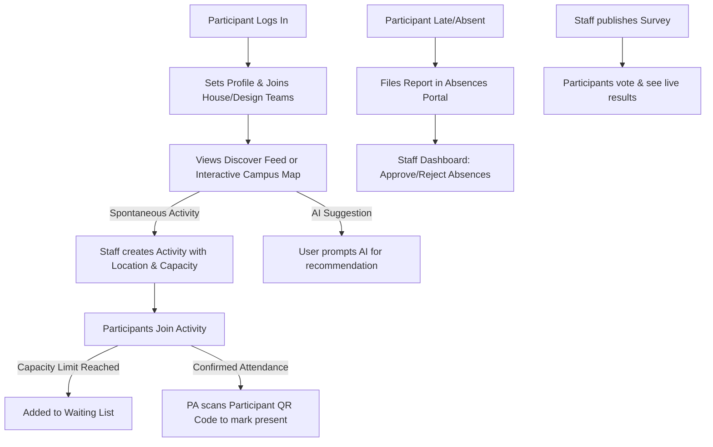

# ShadLoop 🔁

> **ShadLoop** is a premium, AI-first cohort coordination and social planning platform built specifically for SHAD participants and program staff. It resolves the chaos of managing calendars, roll calls, spontaneous activities, and announcements across fragmented chat groups by providing a single, unified, secure workspace.


---

## 🏆 Why ShadLoop Should Win ShadHacks

ShadLoop isn't just a prototype; it's a production-ready solution to the **exact friction points** experienced by SHAD cohorts every summer. Here is why it stands out as the winning project:

1. **AI-First Activity Matching**: Instead of scrolling endlessly through chat groups, participants simply type what they feel like doing (e.g., *"active sports outdoors for 30 mins"*). ShadLoop's custom **Groq-powered Llama 3.1 Edge Function** instantly recommends real-time, matching activities currently scheduled on campus.
2. **Solves Coordinator Roster Pain**: PAs (Program Assistants) and LTs (Leadership Team) spend hours tracking attendance, absences, and role rosters. ShadLoop automates this with **client-side QR codes** and a **live administrative scanner**, saving coordinators valuable time.
3. **Automatic Waitlist Management**: Activities have capacity limits. When a spot fills up, waitlisted members are tracked and automatically promoted in order if someone leaves. No manual coordination needed.
4. **Vibrant UX & SVG Campus Map**: Features a beautiful, customized interactive vector map of a university campus. Students can see active hotspots (Quad, Residences, Gym, Library) and see plans happening there in real-time.
5. **Security & Row Level Security (RLS)**: Enforces robust database security policies directly on Supabase. Roster reading is restricted to staff, role changes are restricted to LTs (excluding self-promotion), and standard participants can only read their private profiles and memberships.

---

## 📖 How It Works: A to Z

Here is the step-by-step lifecycle of ShadLoop in action:



### 1. Account Creation & Team Setup
- All new users sign up and start as standard `SHAD` participants.
- In their **Profile Panel**, they set their display name, upload an avatar image, and choose their official **House Team** and **Design Team** (limited to a maximum of one per account).

### 2. Finding and Creating Activities
- Standard schedules and announcements appear in the dashboard.
- Staff (PAs & LTs) can create free-time activities (e.g., soccer, chess, dinner runs) specifying the category, time, capacity, and campus building.
- Participants browse activities in the grid or click on buildings on the **Interactive Map** to see what plans are scheduled there.
- **The AI Finder**: A student can type a natural language prompt. The Groq API Edge Function parses their request and suggests matching activities.

### 3. Waiting Lists & Automated Promotions
- If an activity capacity is reached, the button turns into **"Join Waitlist"**.
- If a joined member clicks "Leave", they are removed, and the database automatically queries the oldest waitlist entry, deletes them from the queue, and promotes them to joined status. They instantly receive a browser notification: *"You are now joined in [Activity]!"*

### 4. Absences and Lateness Reporting
- If a participant is sick or running late, they fill out a form in the **Absences Portal** specifying the duration, category, and explanation.
- The request appears instantly in the **Staff Dashboard** under **Absences**.
- A PA or LT reviews and clicks **Approve** or **Reject**, which updates the student's status badge in real-time.

### 5. Cohort Consensus via Surveys
- Staff can publish time-limited polls (e.g., selecting tonight's movie).
- Participants cast their votes. Voted items dynamically lock and display progress bars representing the percentage of votes cast for each option.

### 6. QR Code Check-ins
- Every participant has a unique check-in QR code in their profile encoding their User ID.
- At an activity check-in, a PA/LT opens the **QR Attendance** scanner in their dashboard.
- They scan the student's code using their webcam (or select them manually from the roster list) to instantly check them in, marking them as `Present` in the database.

---

## 🛠️ Technology Stack
- **Framework**: React 19, TypeScript, Vite
- **Styling**: Vanilla CSS (Modern custom design system, custom transitions, glassmorphism, responsive navigation)
- **Database**: Supabase PostgreSQL with custom RLS policy configurations
- **AI Matchmaking**: Llama-3.1-8b-instant Edge Function hosted on Supabase and powered by Groq
- **Icons**: Lucide React
- **QR Generation**: QRServer API

---

## 🚀 Setup & Local Execution

### Prerequisites
Make sure you have Node.js and `pnpm` installed.

### Installation
1. Clone the repository and install packages:
   ```bash
   pnpm install
   ```
2. Create your local environment configuration:
   ```bash
   cp .env.example .env.local
   ```
3. Set your public Supabase client variables in `.env.local`:
   ```env
   VITE_SUPABASE_URL=https://your-project.supabase.co
   VITE_SUPABASE_PUBLISHABLE_KEY=your-publishable-key
   ```
4. Apply the database schemas and migrations. Run `supabase/schema.sql` and the SQL migrations in `supabase/migrations/` sequentially in your Supabase SQL Editor.
5. Create your test PA and LT accounts:
   - Create accounts for `pa.test@example.com` and `lt.test@example.com` in your Supabase Auth console (suggested password: `ShadPassword2026!`).
   - Run the updates in `supabase/demo_roles.sql` to elevate their roles in the database.
6. Start the local Vite development server:
   ```bash
   pnpm dev
   ```
